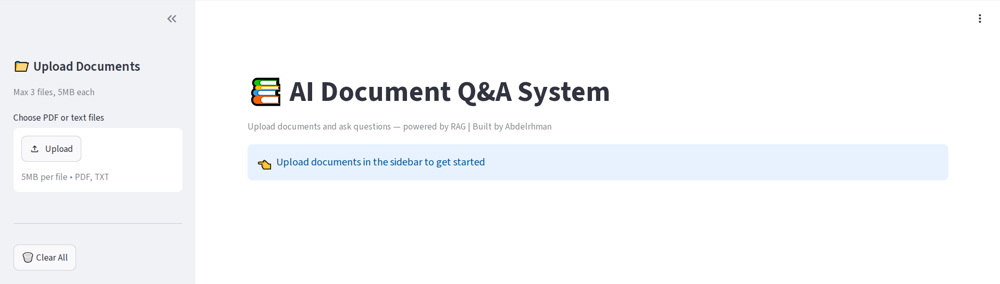
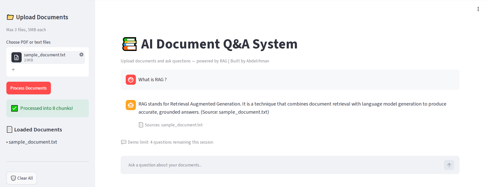

# 🤖 AI Journey — 90-Day AI Engineering Plan

> Building from Python fundamentals to deployed AI applications.
> Follow my progress as I ship real projects every week.

---

## 👨‍💻 About Me
AI Engineer based in Cairo, Egypt.
Building LLM-powered applications with Python, LangChain, and RAG systems.
---

## 🚀 Projects

### 🌟 Featured Project: AI Document Q&A System (RAG)
**[🔗 Live Demo](https://huggingface.co/spaces/AbdelrhmanSamir/ai-document-qa)**

A production RAG (Retrieval-Augmented Generation) system that answers
questions from uploaded documents with zero hallucination and source citations.





**Features:**
- Multi-format document upload (PDF, TXT)
- Semantic search with local embeddings (HuggingFace)
- Zero-hallucination answers with source citations
- Multi-document support with metadata filtering
- Production security: file validation, usage limits, quota protection
- Clean chat-based UI built with Streamlit

**Stack:** Python, LangChain, ChromaDB, HuggingFace Embeddings, Google Gemini API, Streamlit, Docker

**Try it:** Upload any PDF and ask questions — the system only answers
from what's actually in your document, and tells you when it doesn't know.

### 🔌 RAG API Backend (FastAPI)
**[🔗 Live API Docs](https://abdelrhmansamir-rag-api-backend.hf.space/docs)**
 
A standalone REST API exposing the same RAG system as a documented,
authenticated, asynchronous backend — separate from the Streamlit UI
above. Built for integration into other applications, not just human
browser use.
 


 
**Source code:** [`rag_api/`](./rag_api) in this repository
**Deployment:** Docker container on HuggingFace Spaces
*(Note: the HuggingFace Space's own git repo is a deployment target
only — this repository's `rag_api/` folder is the canonical source.)*
 
**Features:**
- API key authentication (`X-API-Key` header)
- Async request handling for concurrent clients
- Automated test suite (pytest + TestClient) — 11 tests passing
- Full interactive documentation with field-level descriptions and validation
**Stack:** FastAPI, Pydantic, pytest, Docker, async/await, ChromaDB,
HuggingFace Embeddings, Google Gemini API
 
---
 
**Example usage:**
 
Upload a document:
```bash
curl -X POST "https://abdelrhmansamir-rag-api-backend.hf.space/upload" \
  -H "x-api-key: YOUR_API_KEY" \
  -F "file=@sample_document.txt"
```
 
Response:
```json
{
  "filename": "sample_document.txt",
  "chunks_created": 8,
  "status": "success"
}
```
 
Ask a question:
```bash
curl -X POST "https://abdelrhmansamir-rag-api-backend.hf.space/ask" \
  -H "x-api-key: YOUR_API_KEY" \
  -H "Content-Type: application/json" \
  -d '{"question": "What is RAG?", "k": 3}'
```
 
Response:
```json
{
  "question": "What is RAG?",
  "answer": "RAG stands for Retrieval Augmented Generation. It is a technique that combines document retrieval with language model generation to produce accurate, grounded answers. (Source: sample_document.txt)",
  "sources": [
    {
      "chunk_id": 1,
      "source_file": "sample_document.txt",
      "preview": "Key responsibilities of an AI Engineer:\n- Building LLM-powered applications\n- Implementing RAG syste"
    }
  ],
  "chunks_used": 3
}
```
 
*Note: this is a demo with limited free-tier API quota. For full access
or a live walkthrough, feel free to reach out via LinkedIn.*

### 🤖 AI Agents (Week 5)
**Source code:** [`agents/`](./agents) in this repository

A progression of increasingly sophisticated AI agents built with
LangChain and LangGraph:

| Day | File | What It Demonstrates |
|-----|------|----------------------|
| 29 | `day29_basic_agent.py` | First real agent — multi-step tool chaining with `create_react_agent` |
| 30 | `day30_chaining.py` | 3-step sequential chain — job search → currency convert → percentage |
| 31 | `day31_parallel.py` | Parallel tool execution investigation — timing analysis with async tools |
| 32 | `day32_web_search.py` | Live web search via Tavily + dynamic date system prompt |
| 33 | `day33_rag_agent.py` | **Most advanced** — RAG + web search combined, agent routes between private documents and live internet |

**Tools built across Week 5:**
- Financial calculators (percentage, compound interest, currency)
- Egyptian tech job market lookup
- Live web search (Tavily)
- RAG document loader and searcher

**Key capability proven on Day 33:**
One agent answering from both your uploaded documents AND the live web,
choosing the right source automatically and synthesizing both when needed.

---

### Project 0: CSV Analyzer (Day 5)
A command-line tool that analyzes any CSV file and displays statistics.
- **Stack:** Python, argparse, csv module
- **Run:** `cd csv_analyzer && python analyzer.py --file data.csv`

### Project 1: Zaki — AI Chatbot (Day 9)
Multi-turn terminal chatbot with memory and token tracking.
- **Stack:** Python, Gemini API, google-genai
- **Run:** `cd chatbot && python day9_chatbot.py`

### Project 2: Prompt Engineering Lab (Day 10)
Experiments with zero-shot, few-shot, CoT, and templates.
- **Stack:** Python, Gemini API, PromptTemplate class
- **Run:** `python day10_prompts.py`

### Project 3: AI Data Extractor (Day 11)
Extracts structured JSON from job descriptions and CVs.
- **Stack:** Python, Gemini API, JSON validation
- **Run:** `python day11_structured_outputs.py`

### Project 4: Zaki Financial Assistant (Day 12)
AI assistant with function calling — calculator, currency, jobs.
- **Stack:** Python, Gemini API, function calling
- **Run:** `python day12_function_calling.py`

---

## 📅 Progress Tracker

| Day | Topic | Status |
|-----|-------|--------|
| 1 | Environment Setup | ✅ |
| 2 | Python Fundamentals | ✅ |
| 3 | File Handling + Git | ✅ |
| 4 | OOP | ✅ |
| 5 | CSV Analyzer Project | ✅ |
| 6-7 | Git Mastery + Review | ✅ |
| 8 | Gemini API Basics | ✅ |
| 9 | Multi-turn Chatbot | ✅ |
| 10 | Prompt Engineering | ✅ |
| 11 | Structured Outputs | ✅ |
| 12 | Function Calling | ✅ |
| 13-14 | LinkedIn + Week 2 Review | ✅ |
| 15 | RAG Foundations | ✅ |
| 16 | Embeddings + Vector Store | ✅ |
| 17 | Full RAG Pipeline | ✅ |
| 18 | Multi-Document RAG | ✅ |
| 19 | Streamlit UI | ✅ |
| 20 | Permanent Deployment | ✅ |
| 21 | Week 3 Wrap-up | 🔄 |
| 22+ | FastAPI + Production | ⏳ |

---

## 🛠️ Tech Stack


---

## 📫 Connect
- GitHub: [@abdelrhman-builds](https://github.com/abdelrhman-builds)
- LinkedIn: [Abdelrhman Samir](https://www.linkedin.com/in/abdelrhman-samir-ai)
- Journey: Building AI applications one day at a time